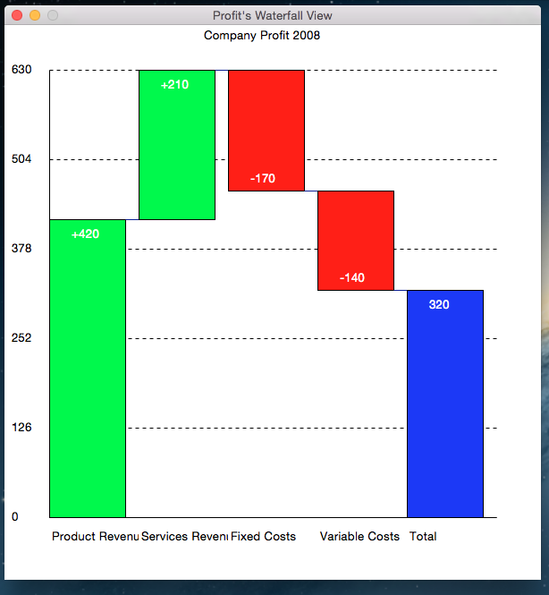

Waterfall
==========

This module applies another way of Data Visualization - <a href="http://en.wikipedia.org/wiki/Waterfall_chart">Find out about it in Wikipedia</a>
<br/>

To get access to it, download it and keep it in your project folder, and import it. <br/>
```
from WaterfallChart import WaterfallA, WaterfallXY
```
<br/>
There are altogether two ways to apply it and get the Waterfall Chart. 
<br/>
<br/>
One is by giving the amounts, up and down, from which it will form the chart. 
<br/>
Example: 
```
data = {'x':['Product Revenue', 'Services Revenue', 'Fixed Costs', 'Variable Costs', 'Total'], 
        'y':[420,210,-170,-140], # You can either give at the end for total, but you don't have to, it will automatically do that
        'xLabel': None, # XLabel is optional
        'yLabel': None } # So is YLabel
chart = WaterfallA(data, title="Company Profit 2008", winTitle="Profit's Waterfall View")# If you don't want total, make sure len(y) == len(x) and give total=False, and title and winTitle both are optional
# chart.config_title("Title name") You can use to config the title, later on also
chart.display() # To display the chart
```
<br/>

<br/>
The other way, is by givving the plots. I am not sure but there might be a situation, where you have the plots, all you need is the 
chart. That is why you can use XY. 
<br/>
Example:
```
data = {'x':['Product Revenue', 'Services Revenue', 'Fixed Costs', 'Variable Costs', 'Total'], 
        'y':[420,730,500,140], # You can either give at the end for total, but you don't have to, it will automatically do that
        'xLabel': None, # XLabel is optional
        'yLabel': 'Money(USD)' } # So is YLabel
chart = WaterfallXY(data)
chart.display()
```
<br/>

